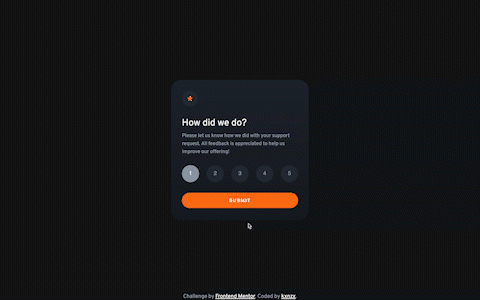
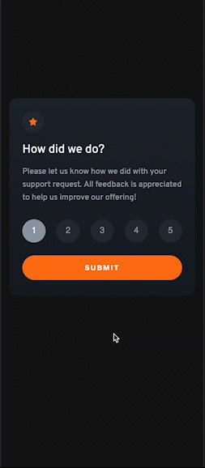

# Frontend Mentor - Interactive Rating Component Solution

This is a solution to the [Interactive Rating Component Challenge on Frontend Mentor](https://www.frontendmentor.io/challenges/interactive-rating-component-koxpeBUmI). Frontend Mentor challenges help you improve your coding skills by building realistic projects.

## Table of contents

- [Overview](#overview)
  - [The challenge](#the-challenge)
  - [Screenshot](#screenshot)
  - [Links](#links)
- [My process](#my-process)
  - [Built with](#built-with)
  - [What I learned](#what-i-learned)
- [Author](#author)

## Overview

### The challenge

Users should be able to:

- View the optimal layout for the app depending on their device's screen size
- See hover states for all interactive elements on the page
- Select and submit a number rating
- See the "Thank you" card state after submitting a rating

### Screenshot

#### Screensize 1440px - Desktop



#### Screensize 375px - Mobile



### Links

- View my Solution on [Frontend Mentor](https://www.frontendmentor.io/solutions/interactive-rating-component-with-vanilla-html-css-and-javascript-SJtP1XU49)
- View the Live Site [here](https://kxnzx.github.io/interactive-rating-component/)

## My process

- HTML semantics
- JavaScript
- Importing Google Fonts
- Set variables
- Reset default settings
- Styles (Mobile First)

### Built with

- Semantic HTML5 markup
- JavaScript
- SASS custom properties
- CSS Grid
- CSS Flexbox
- Mobile-first workflow
- [Google Fonts](https://fonts.google.com/) - For Fonts

### What I learned

Working on this Solution was a challenge! I had to redo the HTML to make the functionality of JavaScript work.

My JS snippets:

```js
// This tells the browser to pay attention to the following elements:
const cardForm = document.querySelector(".card_form");
const cardFormMessage = document.querySelector(".card_form_message");
const button = document.querySelector("button");

// function doSomething(){}
// This is what the browser should do when the onclick event occurs:
function displayRadioValue() {
  const x = document.getElementsByName("ratings");

  for (i = 0; i < x.length; i++) {
    if (x[i].checked)
      document.getElementById("output_value").innerHTML = +x[i].value;
  }
}

// This tells the browser to listen out for clicks on the Button:
button.addEventListener("click", submit);

// function doSomething(){}
// This is what the browser should do when the click event occurs:
function submit() {
  cardForm.classList.add("hide"); // Add display: none; on specified element
  cardFormMessage.classList.remove("hide"); // Remove display: none; on specified element
}
```

## Author

- Frontend Mentor - [@kxnzx](https://www.frontendmentor.io/profile/kxnzx)
